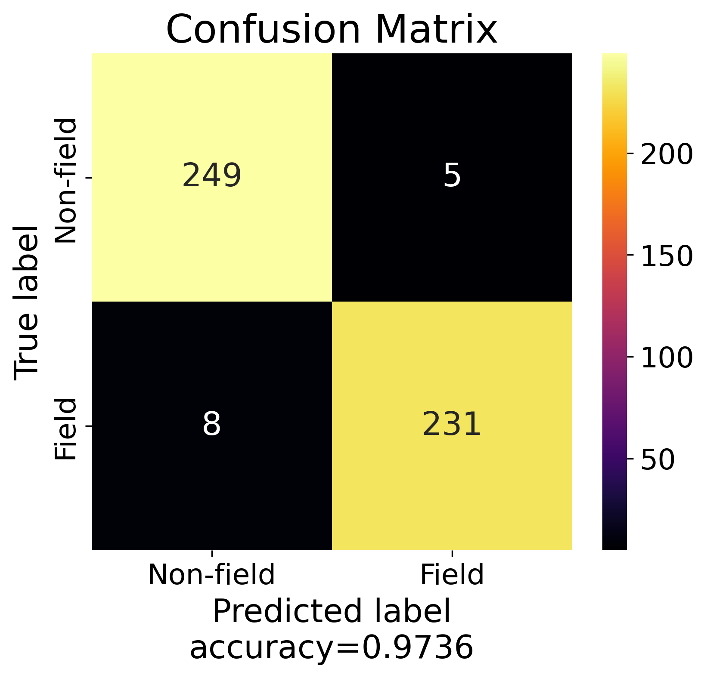
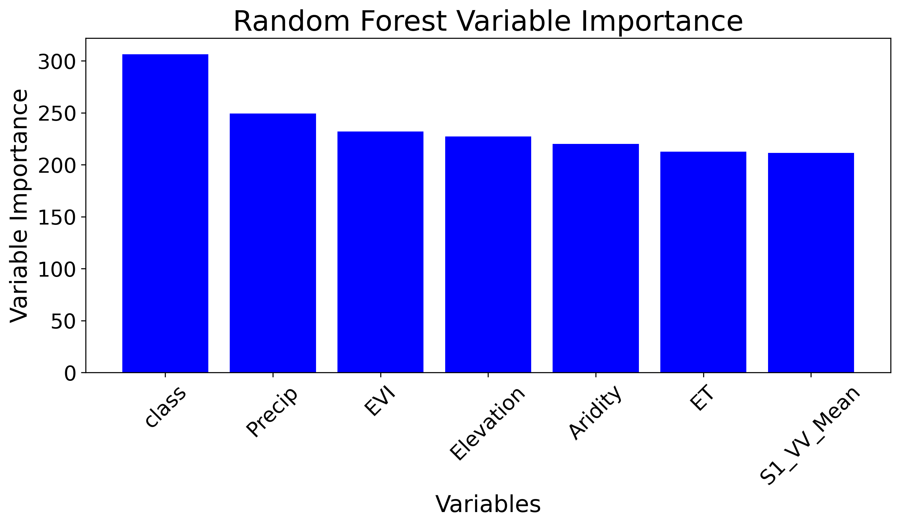
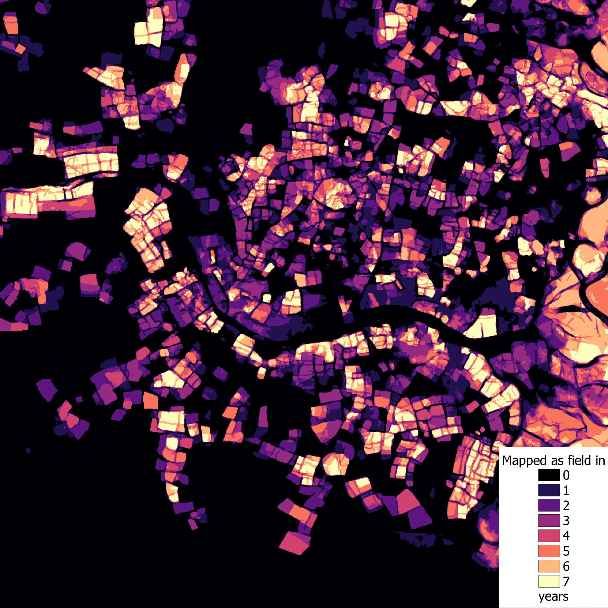
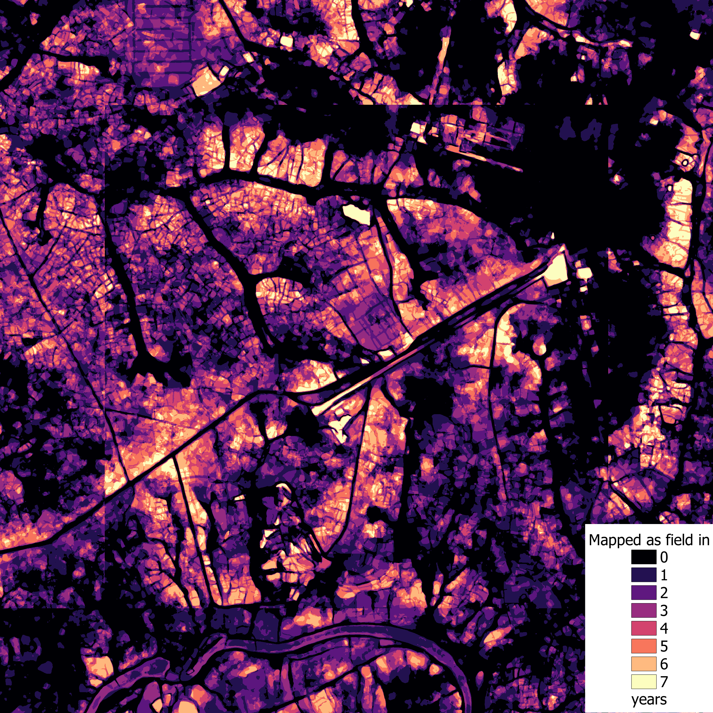

# Notebook Overview

This Repo contains the approach for false positive analysis and cleaning of my crop field prediction with a UNET model in Angola.
The notebook guides users through a workflow for spatial data analysis and classification using a Random Forest model in Google Earth Engine (GEE) using GEEmap in Python. The goal is to create a mask for the prediction, to exclude mostly false-positive pixels.
The workflow is organized into three main sections:

#### Data Source Acknowledgment
This project uses satellite imagery from the PLANET constellation, provided through the [NICFI](https://university.planet.com/page/tfo) (Norway’s International Climate and Forest Initiative) program. I gratefully acknowledge the PLANET-NICFI initiative for making this high-resolution data available, which is essential for the spatial analysis and crop field prediction in this notebook.

---

## 1. Data Preparation

- Loads and preprocesses predicted fractional map and land cover raster
- Creates 500 stratified proportional random sampling points in total
- The points were manually labelled with 1 = crop and 0 = non-crop

---

## 2. Sampling of Predictor Variables in Google Earth Engine

- Loads several relevant predictor variables from Google Earth Engine to discriminate crop fields and non-crop fields
- Stacks predictor variables and resamples them to 10 meter spatial resolution
- Extracts values based on sampling points
- Currently used predictor variables used to train the RF model:
    - **Elevation** derived from [ALOS](https://www.eorc.jaxa.jp/ALOS/en/dataset/aw3d30/aw3d30_e.htm)
    - **Precipitation**, **Evapotranspiration (ET)** and **Aridity Index'** derived from [CHIRPS](https://chc.ucsb.edu/data/chirps) and [MODIS](https://lpdaac.usgs.gov/products/mod16a2v061/)
    - **Sentinel-1 Radar** Imagery Median composite (01-2021 - 12-2024)
    - **Enhanced Vegetation Index (EVI)** based on Sentinel-2
    - **Class** variable (derived from Section 1 in notebook)

---

## 3. Training of Prediction of RF Model 

- Parameters for RF model in GEE:
  - `numberOfTrees=500`
  - `variablesPerSplit=3`
  - `minLeafPopulation=3`
  - `bagFraction=0.85`
  - `seed=42`

- Trains the model on the prepared dataset in **Probability Mode**
- Applies a probability filter for non-crop predictions of .75
--> Pixels with probability lower than .75 will be classified as crop, eveything else non-crop
--> Makes mask more conservative in classifying a pixel as non-crop 

---

## 4. RF Model Performance & Output

- Assesses model performance using standard classification metrics and visualizes the spatial prediction outputs.

### Confusion Matrix

---

### Variable Importance

---

## Post Processing

- Removed speckling effect ("salt and pepper" noise)
---

## Example Predictions

The following tiles show a some examples of UNET model prediction vs. Random Forest model performance, again with the goal to mask out false positive predictions made by UNET.
Please note that The Random Forest model prediction has no-data values where some or all predictor variables were not available (mostly the "class" variable).

### **Example 1**

**Planet Raw Input Data**  

**UNET Fractional Prediction**  

**RF Prediction**  

---

### **Example 2**

**Planet Raw**  

**UNET Fractional Prediction**  

**RF Prediction**  

---

### **Example 3**

**Planet Raw**  

**UNET Fractional Prediction**  

**RF Prediction**  

---

### **Example 4**

**Planet Raw**  

**UNET Fractional Prediction**  

**RF Prediction**  

---

### **Example 4**

**Planet Raw**  

**UNET Fractional Prediction**  

**RF Prediction**  

