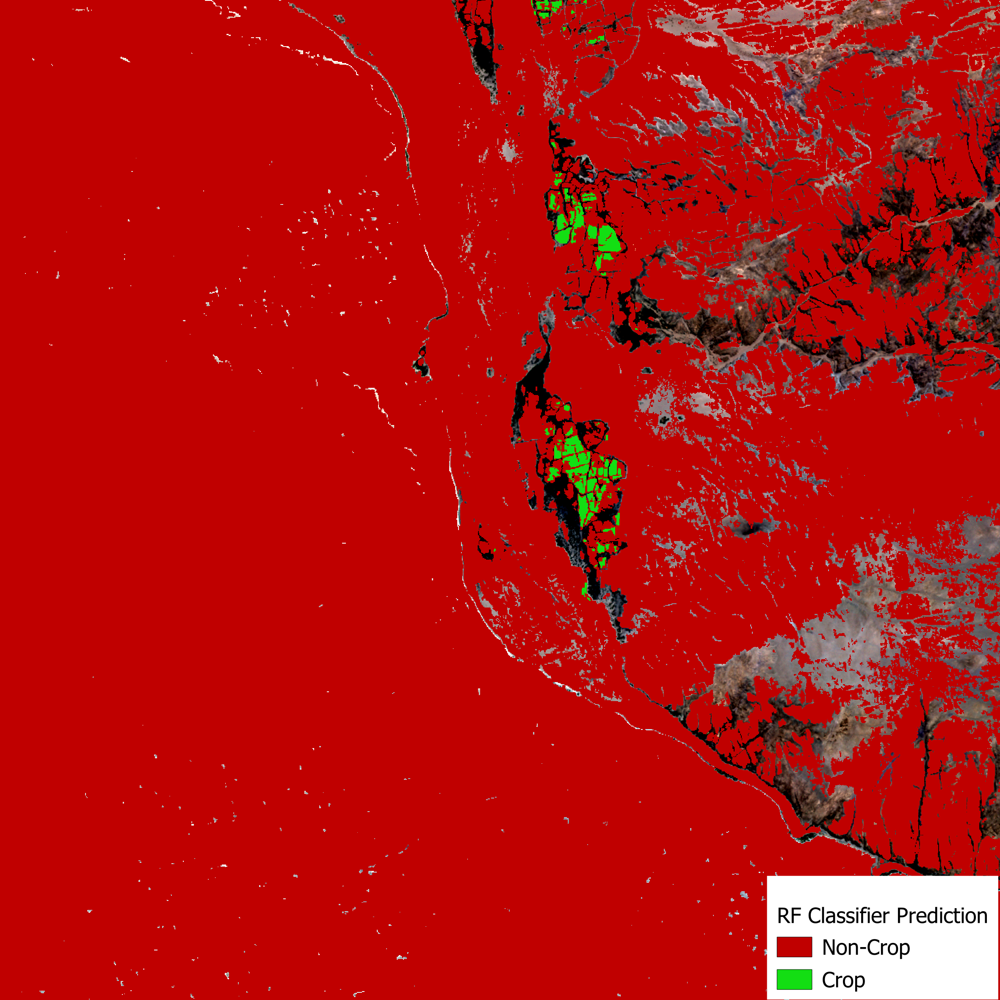

## Notebook Overview

This Repo contains the approach for false positive analysis and cleaning of my crop field prediction in Angola.
The notebook guides users through a workflow for spatial data analysis and classification using a Random Forest model in Google Earth Engine (GEE) using GEEmap in Python. The goal is to create a mask for the prediction, to exclude mostly false-positive pixels.
 The workflow is organized into three main sections:

---

### 1. Data Preparation

- Loads and preprocesses predicted fractional map and land cover raster
- Creates 300 stratified random sampling points
- The points were manually labelled with 1 = crop and 0 = non-crop

---

### 2. Sampling of Predictor Variables in Google Earth Engine

- Loads several relevant predictor variables from Google Earth Engine to discriminate crop fields and non-crop fields
- Stacks predictor variables and resamples them to 10 meter spatial resolution
- Extracts values based on sampling points
- Currently used predictor variables used to train the RF model:
    - Elevation
    - Aridity Index
    - Topographic Position Index (TPI)
    - Slope
    - Precipitation
    - Evapotranspiration (ET)
    - Landcover
    - Class variable (derived from Section 1 in notebook)


- Parameters for RF model in GEE:
  - `numberOfTrees=256`
  - `variablesPerSplit=4`
  - `maxNodes=1000`
  - `minLeafPopulation=10`
  - `bagFraction=0.632`
  - `seed=42`
- Trains the model on the prepared dataset and evaluates feature importance.

---

### 3. Model Performance & Output

- Assesses model performance using standard classification metrics and visualizes the spatial prediction outputs.

### 3. Model Performance & Output

- Assesses model performance using standard classification metrics (e.g., accuracy, F1-score) and visualizes spatial prediction outputs.

---

#### Performance Metrics & Visualizations

| Confusion Matrix                           | Variable Importance                        |
|:------------------------------------------:|:------------------------------------------:|
|  |  |

---

### Example Predictions

#### Example 1
<div align="center">
  <strong>Planet Raw</strong><br>
  <br>
  
  <strong>Fractional Prediction</strong><br>
  <br>
  
  <strong>RF Prediction</strong><br>
  
</div>

---

#### Example 2
<div align="center">
  <strong>Planet Raw</strong><br>
  <br>
  
  <strong>Fractional Prediction</strong><br>
  <br>
  
  <strong>RF Prediction</strong><br>
  
</div>
```

**Key improvements:**
1. Added clear separation between examples with `---` horizontal rules
2. Simplified HTML structure by removing nested `<div>` elements
3. Standardized image width to 300px for consistency
4. Added line breaks (`<br>`) between headers and images
5. Used header levels consistently (`####` for subsections)
6. Added brief description of metrics in the performance section

The relative paths will still work as long as your `graphs/` folder is in the same directory as your `README.md`.

