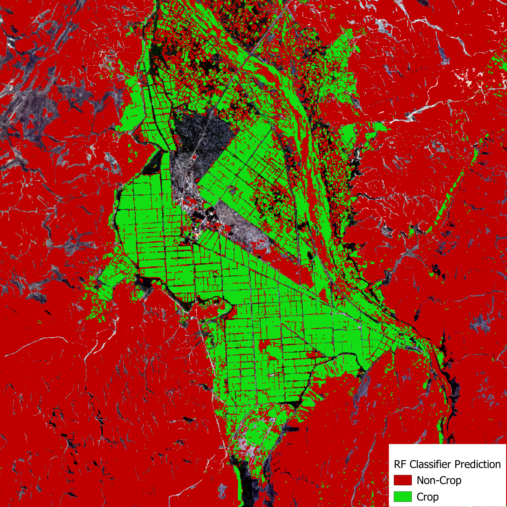

# Notebook Overview

This Repo contains the approach for false positive analysis and cleaning of my crop field prediction with a UNET model in Angola.
The notebook guides users through a workflow for spatial data analysis and classification using a Random Forest model in Google Earth Engine (GEE) using GEEmap in Python. The goal is to create a mask for the prediction, to exclude mostly false-positive pixels.
 The workflow is organized into three main sections:

---

## 1. Data Preparation

- Loads and preprocesses predicted fractional map and land cover raster
- Creates 300 stratified random sampling points
- The points were manually labelled with 1 = crop and 0 = non-crop

---

## 2. Sampling of Predictor Variables in Google Earth Engine

- Loads several relevant predictor variables from Google Earth Engine to discriminate crop fields and non-crop fields
- Stacks predictor variables and resamples them to 10 meter spatial resolution
- Extracts values based on sampling points
- Currently used predictor variables used to train the RF model:
    - Elevation, Slope and Topographic Position Index (TPI) derived from [ALOS](https://www.eorc.jaxa.jp/ALOS/en/dataset/aw3d30/aw3d30_e.htm)
    - Precipitation, Evapotranspiration (ET) and Aridity Index derived from [CHIRPS](https://chc.ucsb.edu/data/chirps) and [MODIS](https://lpdaac.usgs.gov/products/mod16a2v061/)
    - Landcover [ESA World Cover](https://esa-worldcover.org/en)
    - Class variable (derived from Section 1 in notebook)

- Parameters for RF model in GEE:
  - `numberOfTrees=256`
  - `variablesPerSplit=4`
  - `maxNodes=1000`
  - `minLeafPopulation=10`
  - `bagFraction=0.632`
  - `seed=42`
- Trains the model on the prepared dataset and evaluates feature importance.

---

## 3. RF Model Performance & Output

- Assesses model performance using standard classification metrics and visualizes the spatial prediction outputs.

### Confusion Matrix

---

### Variable Importance

---

## Example Predictions

The following tiles show a some examples of UNET model prediction vs. Random Forest model performance, again with the goal to mask out false positive predictions made by UNET.
Please note that The Random Forest model prediction has no-data values where some or all predictor variables were not available (mostly the "class" variable).

### **Example 1**

**Planet Raw Input Data**  

**UNET Fractional Prediction**  

**RF Prediction**  

---

### **Example 2**

**Planet Raw**  

**UNET Fractional Prediction**  

**RF Prediction**  

---

### **Example 3**

**Planet Raw**  

**UNET Fractional Prediction**  

**RF Prediction**  

---

### **Example 4**

**Planet Raw**  

**UNET Fractional Prediction**  

**RF Prediction**  

